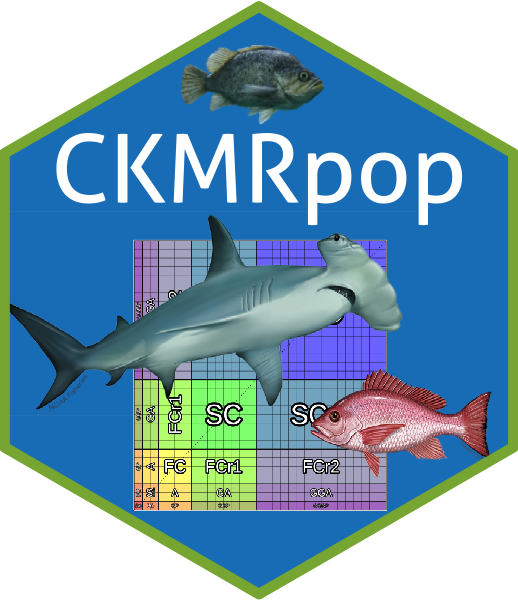

# CKMRpop 

CKMRpop is an R package for forward-in-time simulation and tabulation of
pairwise relationships in age-structured populations. It provides a
wrapper for running the compiled C-program `spip` (Anderson and Dunham
2005), which simulates an age-structured population forward in time. The
output of `spip` is processed by functions in CKMRpop and used to
identify related pairs of individuals in samples taken from the
simulated population.

<!-- badges: start -->

[](https://travis-ci.com/eriqande/CKMRpop)
<!-- badges: end -->

## Installation

To install CKMRpop from GitHub, first do this:

``` r
remotes::install_github("eriqande/CKMRpop")
```

Installing this requires that you have your build environment set up for
compiling RCpp code.

After it is installed, load the library and download and install the
spip binary appropriate for your system (Mac and Linux currently
supported. Not Windows…yet):

``` r
library(CKMRpop)
install_spip(Dir = system.file(package = "CKMRpop"))
```

The following shows an example of the use of CKMRpop for an example life
history.

## Online documentation

The package documentation and vignettes are available in
[pkgdown](https://pkgdown.r-lib.org/) format at
<https://eriqande.github.io/CKMRpop/>

The first vignette in the package demonstrates the use of most of the
functionality in the package in the context of simulation of the life
history of “Species 1” which looks like a fish that can be sampled at
relatively early life stages. It can be found in the “articles” tab on
package website, or you can go directly to it
[here](https://eriqande.github.io/CKMRpop/articles/species_1_simulation.html).

## Literature Cited

<div id="refs" class="references">

<div id="ref-anderson2005spip">

Anderson, Eric C, and Kevin K Dunham. 2005. “Spip 1.0: A Program for
Simulating Pedigrees and Genetic Data in Age-Structured Populations.”
*Molecular Ecology Notes* 5 (2): 459–61.

</div>

</div>
