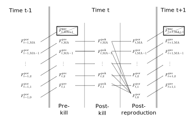
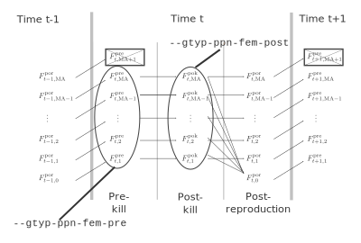
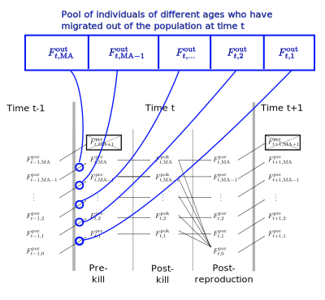

```{r setup, include = FALSE}
knitr::opts_chunk$set(
  collapse = TRUE,
  comment = "#>"
)
```

This provides a short description of a few things that one
should know about how `spip` works.

## Timing of events in a `spip` life cycle

`spip` is a program that records time in discrete periods that can be
thought of as years.  When individuals are born at time $t$ they are considered
to be of age 0 and they have a birth year of $t$.  The user must input to the program
the maximum possible age of an individual.  Here, we will refer that
maximum age as $\mathrm{MA}$. 

Within each year in `spip` the following events occur, in order:

1. The age of each individual is incremented at the beginning of the new year $t$. This
means that newborns from year $t-1$ are turned into 1-year-olds as they enter year $t$,
and so forth.
1. Next there is a chance to sample individuals before the death episode.  Only individuals
of ages 1 to $\mathrm{MA}$ can be sampled.  These are the individuals, who, if they
survive the upcoming death episode, might have the chance to contribute to the
next generation.
1. Next there is an episode of death.  Individuals that are $a$ years old in year $t$
survive this episode of death with a probability of $s_a$. Individuals that are 
$\mathrm{MA} + 1$ are all killed with probability of 1. 
1. Then there is a chance to sample individuals after the episode of death.
Only individuals of ages 1 to $\mathrm{MA}$ can be sampled.  This is a sample
from the individuals that are around and alive to contribute to the next generation.
1. Next there is an episode of reproduction which produces 0-year-olds born at time
$t$. 
    - During the reproduction episode there is an opportunity
      to draw a sample from the individuals that were chosen to 
      be amongst the reproducing adults.  (This is particularly useful for critters like
      salmon that can be sampled explicitly when they are migrating in fresh water to
      reproduce).
    - After the sampling period during reproduction, there is also the chance for
      individuals to die after reproduction according to the probability
      set by `--fem-postrep-die` and `--male-postrep-die`.  With this value set
      to 1, for example, semelparity can be enforced.
1. After reproduction there are individuals of ages 0 to $\mathrm{MA}$ that
sit around and don't do much of anything.  Eventually the year gets advanced
to the following one ($t+1$), and the ages of individuals get incremented, so that
at the beginning of year $t+1$ individuals are of ages 1 to $\mathrm{MA}+1$.  


It is worth noting that even though there are some $\mathrm{MA}+1$-year-olds around
at the beginning of each time period, they all die
during the episode of death, and, because they cannot be sampled during the
sampling episode before death, it is like they do not exist.


The year in spip can thus be divided into three different periods between
the demographic events/episodes:

1. The period before the episode of death.  This is known as the _prekill_
period of the year, and, in the following, we will use a
superscript $\mbox{}^\mathrm{pre}$ to denote census sizes during that period.
2. The period after the episode of death, but before reproduction.  This
is known as the _postkill_ period, and will be denoted with a superscript
$\mbox{}^\mathrm{pok}$.
3. The period after reproduction, but before the year gets incremented. This
is the _post-reproduction_ period and will be denoted with a superscript
$\mbox{}^\mathrm{por}$.

We will use $F_{t,a}^\mathrm{pre}$, $F_{t,a}^\mathrm{pok}$, and $F_{t,a}^\mathrm{por}$
to denote the number of $a$-year-old females during the
prekill, postkill, and post-reproduction periods, respectively, of time $t$.
The diagram below, showing these numbers in relation to one another,
along with notations of their expected values
should help users to understand the spip annual cycle.
The numbers of males change across time periods in a similar fashion.
```{r, echo=FALSE, out.width="100%"}

```

Annotated in the above are the three distinct periods in spip's annual cycle:
the _prekill_, _postkill_ and _post-reproductive_ periods.  When the output
of spip is slurped up by CKMRpop, these numbers become the respective tibbles
(elements of the output list of `slurp_spip()`) of: `census_prekill`, `census_postkill`,
and `census_postrepro`, respectively.

The expected numbers of individuals after each transition is as follows:

- $F_{t,a}^\mathrm{pre} \equiv F_{t-1,a-1}^\mathrm{por}~~,~~a = 1,\ldots,\mathrm{MA}$
- $E[F_{t,a}^\mathrm{pok}] = s_a^F F_{t,a}^\mathrm{pre}~~,~~a = 1,\ldots,\mathrm{MA}$, where $s_a^F$ is the probability that an $a-1$  year old female survives to be an $a$ year old female, as given with the `--fem-surv-probs` option. 
- $E[F_{t,a}^\mathrm{por}] = (1 -  r_a^Fd_a^F) F_{t,a}^\mathrm{pok}~~,~~a = 1,\ldots,\mathrm{MA}$, where $r_a^F$ is the probability that an $a$-year-old
female reproduces (set with the `--fem-prob-repro` option) and $d_a^F$ is the
probability that an $a$-year-old female will die after engaging in reproduction
(even if no offspring were actually produced!), as given
in the `--fem-postrep-die` option.  This is an additional source of death
that is useful for modeling anadromous species whose reproductive journey
incurs a substantial cost.

## Sampling episodes in a `spip` annual cycle

The two main sampling schemes available in spip are keyed to these different
time periods within the spip annual cycle as shown by the following figure:
```{r, echo=FALSE, out.width="100%"}

```
Thus, `--gtyp-ppn-fem-pre` and `--gtyp-ppn-male-pre` involve sampling
from the simulated population at a different point in the year than
do the `--gtyp-ppn-fem-post` and `--gtyp-ppn-male-post` options.  
It is also possible to only sample those individuals that are trying to
reproduce in a certain year using a third sampling scheme requested with the
`--gtyp-ppn-fem-dur` and `--gtyp-ppn-male-dur` options
to spip.  The probability that an individual would try to reproduce
in a given year is age specific and is set using the `--fem-prob-repro` 
and `--male-prob-repro` options.

It is worth noting that the `pre`, `post` and `dur`, sampling options all
occur relatively independently (so long as sampling is not lethal---see the
somewhat experimental `--lethal-sampling` option). spip reports the different
years when an individual is sampled during the `pre`, `post`, and `dur`
periods in the year. CKMRpop preserves those times in separate lists
when it slurps up the spip output.  For example `slurped$samples` has the
list columns: `samp_years_list_pre`, `samp_years_list_post`, and `samp_years_list_dur`.
For all downstream analyses, CKMRpop uses the list column `samp_years_list`, which,
by default is the same as the `samp_years_list_post`.  This means, at the present
time, you should use the options to sample individuals after the episode of death
using the the `--gtyp-ppn-fem-post` and `--gtyp-ppn-male-post` options.

Note that, in most cases when exploring CKMR, the user will want to 
use the `--gtyp-ppn-fem-post` and `--gtyp-ppn-male-post` options, anyway, because
those are samples from the adult population that are available for reproduction.

If it is desired to sample all newborns at time $t$, then currently the way to do
that is to sample 1-year-olds at time $t+1$ using the
`--gtyp-ppn-fem-pre` and `--gtyp-ppn-male-pre` options.  However, it would take some
extra finagling to get those sampling years into the `samp_years_list` column
referenced above for the downstream analyses.


TODO ITEM: combine sampling at all times into the single `samp_years_list` column, perhaps,
or make it easier for users to decide how to combine those different sampling
episodes.  For now, though, users should stick to using the
`--gtyp-ppn-fem-post` and `--gtyp-ppn-male-post` options.

## How inter-population migration occurs in `spip`

We can use the same diagrams developed above to describe how migration is implemented
in `spip`.  Migration in `spip` is a "two-stage" phenomenon: in the first stage,
individuals leave a population with sex-, year- and age-specific out-migration rates
specified with the population's options `--fem-prob-mig-out` and
`--male-prob-mig-out`.
They leave each population before the prekill census occurs and also before the prekill
sampling occurs.  Diagrammatically,
it looks like this:
```{r, echo=FALSE, out.width="100%", fig.cap="Schematic describing the first stage of migration: migration out of a population. Each blue line shows individuals leaving the population and entering a pool of migrants."}

```

The expected numbers of individuals in the pool of migrants who have left the population
is given by the time- and age-specific rates set by the user.  We will denote the outmigration
rate for age $a$ individuals at time $t$ from a given population by $m^\mathrm{out}_{t,a}$.
It follows then that, for this given population:
$$
E[F^\mathrm{out}_{t,a}] = m^\mathrm{out}_{t,a}F_{t-1,a-1},~a=1,\ldots, \mathrm{MA}.
$$

In the following, we will want to refer to these outmigration rates for each
population, so we may also adorn the notation, thus:
$$
E[F^{\mathrm{out},i}_{t,a}] = m^{\mathrm{out},i}_{t,a}F^i_{t-1,a-1},~a=1,\ldots, \mathrm{MA}.
$$

to refer to rates and sizes specifically for population $i$.


After the outmigration stage, each population has a pool of migrants that are waiting
to migrate into other populations.  The rates by which this happens are specified
with the `--fem-prob-mig-in` and `--male-prob-mig-in` 
options. These options set in-migration rates for different years and
for different ages, effectively setting the fraction of the total number
of out-migrated individuals from population $i$ of age $a$ at time $t$,
$F^{\mathrm{out},i}_{t,a}$, that will migrate into the other populations. Thus,
there is one number to set for each population.  For example, if
there are $K$ populations, we would have:
$$
m^{\mathrm{in},i}_{t,a} = [m^{\mathrm{in},i}_{t,a,1},\ldots,m^{\mathrm{in},i}_{t,a,K}]~~,~~
\sum_{j=1}^K m^{\mathrm{in},i}_{t,a,j} = 1.
$$
The probability of migrating back to the population from whence one came
is always 0.  So, even if the user sets that to some non-zero value, 
it will be forced to zero and the values of the remaining in-migration rates will
be re-scaled so as to sum to 1.

Given this set up, the expected number of individuals from the
outmigrant pool from population $i$ that will arrive in population $j$,
of age $a$ at time $t$ is
$$
E[F^{\mathrm{in},i}_{t,a,j}] = m^{\mathrm{in},i}_{t,a,j} F^{\mathrm{out},i}_{t,a}
$$
And, so we can also write that entirely in terms of current population sizes
and migration rates:
$$
E[F^{\mathrm{in},i}_{t,a,j}] = m^{\mathrm{in},i}_{t,a,j} m^{\mathrm{out},i}_{t,a}F^i_{t-1,a-1}
$$

So, this whole system of specifying migrants is a little more complex than
a system whereby the user specifies the fraction of individuals in population
$j$ that originated from population $i$.  But, it does provide a lot more control
by the user, as well as realism, in that the number of migrants into a population
depends on the size of the donor population.
