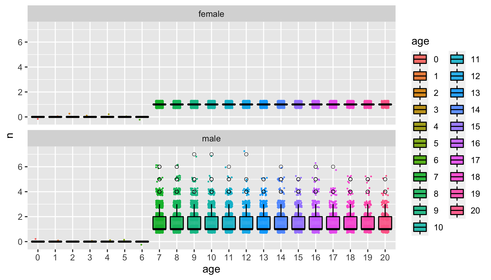

```{r setup, include = FALSE}
knitr::opts_chunk$set(
  collapse = TRUE,
  comment = "#>"
)
```


The goal here is to get SLiM to record ancestry vectors and then just
use those amongst the sampled individuals, so we don't have to recurse over
pedigrees at all, etc.

I  just copied the other vignette into here and will leave much of that
as reference.

## Introduction

CKMRpop was developed to crunch and slurp the output of the simulation
package `spip`; however other programs can be configured to produce the output
needed for CKMRpop to create the summaries that it does.

Currently, the files of massaged spip output that CKMRpop uses look like the following
(each file's name is listed between `==> XXX <==` markers, and then the first 10 lines of
the file are shown).
```
% head spip*.tsv
==> spip_deaths.tsv <==
ID	year	age
M3_0_0	5	2
M3_0_4	5	2
M3_0_5	5	2
M3_0_10	5	2
M3_0_13	5	2
M3_0_16	5	2
M3_0_18	5	2
M3_0_20	5	2
M3_0_21	5	2

==> spip_genotypes.tsv <==
F5_0_100	2/2
M5_0_84	1/1
M7_0_1	1/1
M7_0_92	1/1
F8_0_85	1/2
F8_0_95	2/2
M8_0_51	1/1
M8_0_56	2/2
M8_0_91	2/1
F9_0_17	1/1

==> spip_migrants.tsv <==
year	age	event
5	1	M4_0_6 0 -> 2
5	1	M4_0_11 0 -> 1
5	1	M4_0_12 0 -> 1
5	1	M4_0_19 0 -> 1
5	1	M4_0_20 0 -> 1
5	1	M4_0_28 0 -> 1
5	1	M4_0_29 0 -> 1
5	1	M4_0_43 0 -> 1
5	1	M4_0_44 0 -> 1

==> spip_pedigree.tsv <==
year	pop	kid	pa	ma
0	0	M0_0_0	0	0
0	0	M0_0_1	0	0
0	0	M0_0_2	0	0
0	0	M0_0_3	0	0
0	0	M0_0_4	0	0
0	0	M0_0_5	0	0
0	0	M0_0_6	0	0
0	0	M0_0_7	0	0
0	0	M0_0_8	0	0

==> spip_postkill_census.tsv <==
year	pop	age	male	female
5	0	1	99	101
5	0	2	78	90
5	0	3	66	73
5	0	4	52	55
5	0	5	49	50
5	1	1	142	136
5	1	2	94	87
5	1	3	70	70
5	1	4	54	57

==> spip_prekill_census.tsv <==
year	pop	age	male	female
5	0	1	99	101
5	0	2	125	125
5	0	3	87	87
5	0	4	70	70
5	0	5	56	56
5	1	1	142	136
5	1	2	125	125
5	1	3	87	87
5	1	4	70	70

==> spip_samples.tsv <==
ID	syears_pre	pop_pre	syears_post	pop_post	syears_dur	pop_dur
F5_0_100			10	0
M5_0_84			10	0
M7_0_1			12	0
M7_0_92			11	0
F8_0_85			11	0
F8_0_95			10	0
M8_0_51			10	0
M8_0_56			13	0
M8_0_91			10	0
```
The structure of the files is largely self-explanatory, but here are a
few pertinent notes:

1. The IDs of the individuals are of the form:
`Sex + BornYear + "_" + Subpop_Index + "_" + AnInteger`.  So, for example,
`F8_0_85` is a female (with ID 85) born in year 8.  Some functions within
CKMRpop parse these IDs to retrieve the sex and birth year of the individual.

2. The files are TAB-delimited.

3. Migration events are recorded as space-delimited phrases like: `M4_0_6 0 -> 2`,
which says that `M4_0_6` migrated from subpopulation `0` to subpopulation `2`.

4. The pedigree must be the complete pedigree of the population.

In order to use a different simulation program, one approach is to simply
write out output files like the above from the simulation output of your
simulation engine of choice.  Another possibility is to use the internal
pedigree recording mechanism (if it exists) of your preferred simulation
program.

I illustrate these two different approaches in the following two
section using the outstanding, full-featured, and well-supported
population genetic simulation software, SLiM Version 3 [@haller2019slim]. 

## Writing SLiM output to files

Before doing anything else here, let us load some useful libraries:
```{r}
library(CKMRpop)
library(tidyverse)

# also define a variable that says whether or not we should evaluate
# code chunks that depend on having SLiM installed on the system.  
eval_slim_dep <- file.exists("/usr/local/bin/slim")
```

By way of example, here I devise a simulation in SLiM, Version 3.6,
that approximates the `species_1_simulation` in the other vignette. 
It approximates it in the sense that the maximum age and the survival
probabilities are similar between the two simulations; however I did not
spend a lot of time tweaking the SLiM script to have overdispersion in
family sizes, or a mating pattern that looks like what is coded up in `spip`
in the other vignette.  

This SLiM script
can be found in the package extras at:
```{r, eval=FALSE}
system.file("SLiM/slim-example-1.slim", package = "CKMRpop")
```
It looks like this:
```cpp
`r paste(readLines(system.file("SLiM/slim-example-1.slim", package = "CKMRpop")), collapse = "\n")`
```


If you have `SLiM` on your path, this SLiM simulation script can be run within R
like this (using seed 1001, and also ensuring that the output files are written
to an R temporary directory):
```{r, eval=eval_slim_dep}
slim_script <-  system.file("SLiM/slim-example-1.slim", package = "CKMRpop")
tdir = tempfile()
dir.create(tdir, recursive = TRUE, showWarnings = FALSE)

call <- paste0("cd ", tdir, "; ", "SLiM -s 1001 ", slim_script, collapse = "")

system(call)

```

Once that is complete, the output from the simulation can be slurped up like this:
```{r, eval=eval_slim_dep}

slurped <- slurp_spip(tdir, 2)
```


If you do that with SLiM (not done here, because SLiM is not installed on
CRAN's servers) you can take the resulting `slurped` variable and run it through
all the other functions in the `species_1_simulation` vignette and see how
everything turns out. 

For example, if we look at the offspring number of males and females we
see that the way I set this SLiM simulation up there is at most one offspring
per female each year.  That's a little silly, but it was my first real stab at
using SLiM (which, by the way, is completely **AWESOME**).
```{r, eval=eval_slim_dep, out.width='100%', fig.width=7, fig.height=4}
offs_and_mates = summarize_offspring_and_mate_numbers(
  census_postkill = slurped$census_postkill,
  pedigree = slurped$pedigree,
  deaths = slurped$deaths,
  lifetime_hexbin_width = c(1,2)
)

num_offs_plot = offs_and_mates$plot_age_specific_number_of_offspring

num_offs_plot
```
```{r, eval=!eval_slim_dep, echo=FALSE, out.width="100%"}

```
At any rate, this shows the utility of inspecting the outputs of one's simulation


## Simulating with SLiM, but Recording Ancestral Lineages Internally

The current version of SLiM provides an option that will store the IDs of the
parents and grandparents of each individual in the simulation.  When these
individuals are sampled, that information can be compiled into an ancestry vector,
as used by CKMRpop, and then those ancestry vectors can be used directly to find
related pairs amongst the sampled individuals.
This carries the advantage that it is not necessary to write out to a file the
complete pedigree of the population.  This could potentially save a lot of time
when simulating very large population sizes.  Furthermore, although CKMRpop's 
kin finding algorithm (implemented via recursive functions in C++) that operates on the 
pedigree is quite fast, as currently implemented, it requires a lot of time
to set up the data structures in large populations.  Using SLiM's internal pedigree
recording could not only avoid that extra time cost, but it could also minimize or
eliminate the need for C++ code within the CKMRpop package, which would aid usability for people
that don't have a compiler on their system.

The starting point for this approach is similar to our last example use of SLiM.  We 
would start with the previous SLiM script and modify it so as to:

1. Not write out the pedigree of every single simulated individual.
2. Do write out the ancestry vectors of the sampled individuals.
3. Provide the `slurp_spip()` function with a few options telling it not to
bother with getting and processing a pedigree file.
4. Directly use the sampled individual's ancestry vectors from SLiM to
determine who are relatives of one another.

After doing this, we won't have all the information needed to analyze how many
mating partners each individual had (that produced offspring), etc., but we can
compile up the related pairs of individuals.

In the example that follows, I do not execute #1 from the list above,
because I want to compare the pedigree obtatined by recursively traversing the
complete pedigree from sampled individuals to that obtained by writing out SLiM's internal pedigree
information for only the sampled individuals.  (As we see below, the two approaches
yield identical results, but the latter will be faster---and noticeably so
in large populations, I expect.)

A simple, example SLiM script for doing the simulation whilst outputting
the internal pedigree information for sampled individuals
can be found in the package extras at:
```{r, eval=FALSE}
system.file("SLiM/slim-example-2.slim", package = "CKMRpop")
```
It looks like this:
```cpp
`r paste(readLines(system.file("SLiM/slim-example-2.slim", package = "CKMRpop")), collapse = "\n")`
```

We can run that from within R like this:
```{r, eval=eval_slim_dep}
slim_script <-  system.file("SLiM/slim-example-2.slim", package = "CKMRpop")
tdir = tempfile()
dir.create(tdir, recursive = TRUE, showWarnings = FALSE)

call <- paste0("cd ", tdir, "; ", "SLiM -s 1001 ", slim_script, collapse = "")

system(call)

```

And then we can gather all that information into CKMRpop:
```{r, eval=eval_slim_dep}
# First we do it while not reading the
# complete population pedigree but reading in the ancestries,  like this:
s2 <- slurp_spip(
  tdir, 
  2, 
  read_pedigree_file = FALSE, 
  find_ancestors_and_relatives = FALSE
)

# get the ancestries
anc <- read_tsv(file.path(tdir, "ancestries.tsv"), col_types = "ic") %>%
  arrange(ID) %>%
  mutate(ancestors = str_split(ancestors, ",")) %>% 
  filter(!duplicated(ID)) 

# Note, the last filter above is important: if some individuals were sampled
# multiple times in their lifetime, we still only want them to appear once here.


# find the relatives from those ancestry vectors
anc_rel <- relatives_from_ancestry_vectors(anc)

```

At this juncture, we have to rename the individuals in the `relatives` column
of the tibble `anc_rel` so as
to use their "full" names that start with F or M and have the year they were
born.  These are all samples, so we actually have all their names, and the pedIDs
are unique so it is not too hard to get that taken care of:
```{r, eval=eval_slim_dep}
full_names <- s2$samples$ID
names(full_names) <- str_match(full_names, "_([0-9]+)$")[,2]
anc_rel2 <- anc_rel %>%
  mutate(
    relatives = map(
      .x = relatives,
      .f = function(x) full_names[as.character(x)]
    ),
    ID = as.character(ID)
  )
```

With that done, we now simply join these with the samples and then run `compile_related_pairs()` on
the result:
```{r, eval=eval_slim_dep}
SAMPLES <- s2$samples %>%
  mutate(pedID = str_match(full_names, "_([0-9]+)$")[,2]) %>%
  left_join(anc_rel2, by = c("pedID" = "ID"))

crel_from_pedIDs <- compile_related_pairs(SAMPLES)

```


### Compare with pairs obtained from the entire output pedigree

It is worth confirming that the approach in which the ancestry of each sampled individual
is recorded using SLiM's pedigreeID functionality yields the same results that we obtain
when printing out the whole pedigree.  Let's confirm that.

First we need to read the output files including the full pedigree.
```{r, eval=eval_slim_dep}
# Second, we read the complete pedigree in and look at
# the ancestry vectors obtained from that method.
s2_old <- slurp_spip(
  tdir, 
  2, 
  read_pedigree_file = TRUE, 
  find_ancestors_and_relatives = TRUE
)

crel_from_full_pedigree <- compile_related_pairs(s2_old$samples)

```

Now we simply need to compare those two results:
```{r, eval=eval_slim_dep}
methods_joined <- full_join(
  crel_from_full_pedigree,
  crel_from_pedIDs, 
  by = c("id_1", "id_2"),
  suffix = c("_full", "pedID")
)


# and check that the inferred pairwise relationships
# between all pairs are the same, regardless of the method
# adopted.
methods_joined %>%
  mutate(comp_dom_relat = (dom_relat_full == dom_relatpedID)) %>%
  count(comp_dom_relat)
```

The above block is not evaluated, because SLiM cannot be installed on CRAN's servers that run
checks on packages, but the both methods yielded the same results.

## Some notes

This is how I determined that SLiM puts its ancestry vectors
in a slightly different order (moms before dads), and hence
permuted their order within the slim script (see the line that
looks like):
```r
		s_anc = s_anc[c(0, 2, 1, 6, 5, 4, 3)]; 
```

We can compare the ancestry vectors from SLiM to those found
by traversing the output pedigree with CKMRpop and see how SLiM orders
individuals in its pedigreeParentIDs and pedigreeGrandparentIDs.
```{r, eval=FALSE}
# rename the columns in anc
anc2 <- anc %>%
  rename(
    pedID = ID,
    anc_vec = ancestors
  )

# first, get the ancestries from each approach together in the same tibble
av_comp <- s2_old$samples %>%
  select(ID, ancestors) %>%
  mutate(
    pedID = as.integer(str_extract(ID, "([0-9]+)$")),
    CKMRpop_anc_vec = map(ancestors, function(x) str_extract(x, "([0-9]+)$"))
  ) %>% 
  select(-ancestors) %>%
  left_join(anc2, by = "pedID") %>%
  rename(slim_anc_vec = anc_vec)

# now we can see where each element of the CKMRpop ancestry vector
# maps into the ancestry vector obtained using SLiM's pedigreeIDs
perms <- av_comp %>%
  mutate(positions = map2(
    .x = CKMRpop_anc_vec,
    .y = slim_anc_vec,
    .f = function(x, y) unname(sapply(x, function(i) which(i == y)))
  )) %>%
  count(positions)

perms$positions[[1]]
```


## References


